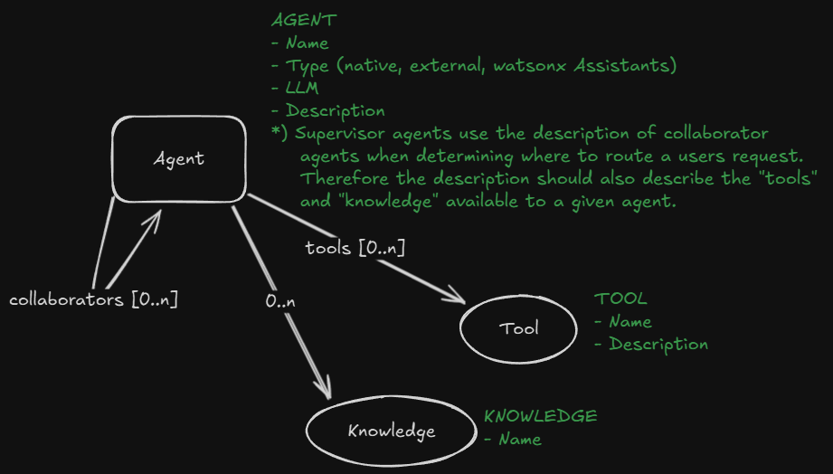
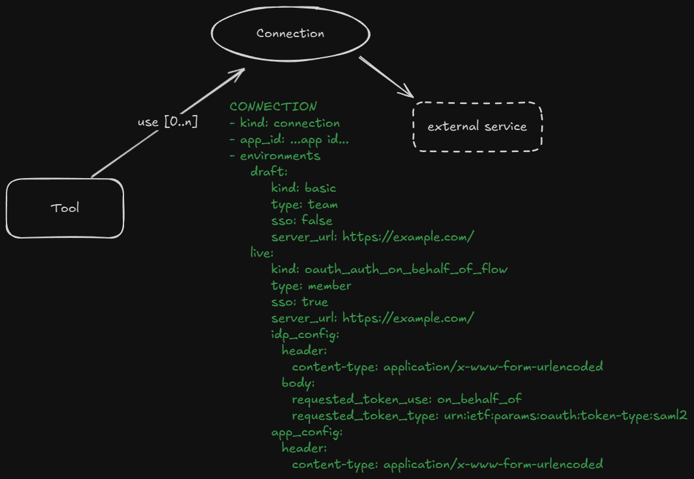

# watsonx Orchestrate ADK samples
This repository contains a set of examples for developing agents and tools for watsonx Orchestrate.

## Prerequisites
The prerequisites for the local installation of a pro-code development environment are at the link 
[watsonx Orchestrate ADK](https://github.com/IBM/ibm-watsonx-orchestrate-adk)

## Agent and Tools collaboration

## Tool and Connection

